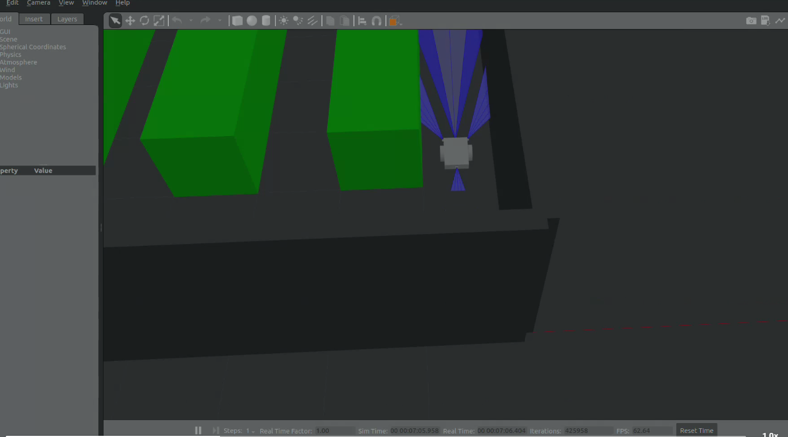
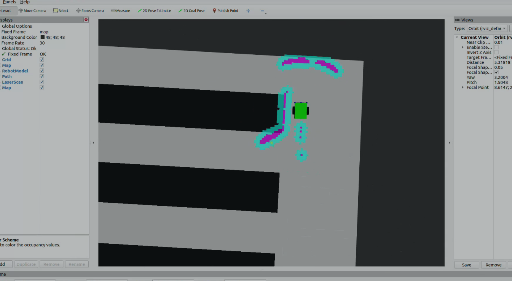

# 🌿 RoBotanic: Autonomous ROS 2 Vision, Control & Navigation System (V3.0)

## 📌 Project Overview
This repository contains the complete, advanced version (V3.0) of the RoBotanic autonomous plant disease detection system. 

What started as a YOLOv11 vision node has now evolved into a **fully autonomous ROS 2 robotic ecosystem**. 

**V3.0 Update:** The system now integrates the **ROS 2 Navigation Stack (Nav2)** and **Gazebo** simulation. The simulated robot can perform real-time autonomous path planning using the **A* (A-Star) algorithm** and distance sensors, perfectly synchronizing autonomous movement with real-time AI disease detection and MATLAB spatial data logging.

## ⚙️ System Architecture (Nodes & Packages)
The architecture is built on a modular ROS 2 workspace containing three primary packages communicating in real-time:

* **`robotanik_vision`**: Captures camera frames and performs YOLOv11 inference (detecting leaves and specific diseases), publishing bounding boxes and detection data.
* **`robotanik_control`**: Subscribes to both the AI detections and spatial/time data (from MATLAB simulations), synchronizes them, and automatically logs the results into a `.csv` file for heat map mapping.
* **`robotanik_sim` (NEW)**: Manages the Gazebo simulation environment, robot physical modeling (URDF), RViz visualization, and Nav2 parameters for autonomous A* path planning.

## 🗺️ Simulation & Path Planning
Below is the visualization of the robot navigating through the simulated agricultural environment using the A* algorithm and real-time sensor data:

### Gazebo World Simulation

*Simulated agricultural world and robot physics.*

### RViz Real-Time Navigation

*Real-time sensor data, costmaps, and A* path execution.*

## 🚀 Key Features
* **Autonomous Navigation:** Nav2 integration with A* path planning and obstacle avoidance.
* **Simulation:** Full environment and robot kinematics deployed in Gazebo & RViz.
* **Middleware:** ROS 2 (Real-time, multi-package node communication).
* **Computer Vision:** OpenCV & YOLOv11 real-time inference.
* **Data Logging (Heat Map Prep):** Automated CSV logging of disease type, timestamps, and coordinates.

## 🛠️ Installation & Usage
Clone the repository into your ROS 2 workspace and build all three packages:

    cd ~/ros2_ws/src
    git clone https://github.com/UmutUsenmez/robotanik-ros2-autonomous.git
    cd ~/ros2_ws
    colcon build --packages-select robotanik_vision robotanik_control robotanik_sim
    source install/setup.bash

## 👨‍💻 Author
**Feyzullah Umut Üşenmez**
Mechatronics Engineering Student @ YTU
Focus Areas: Autonomous Systems, Computer Vision, Embedded AI
